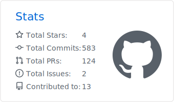
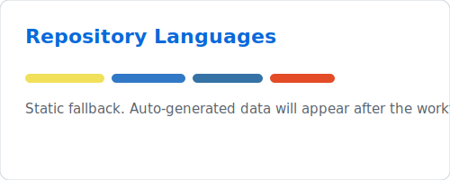
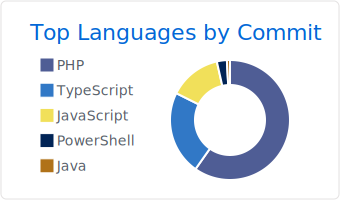
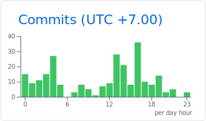

# Tran Le Kiet (Aka Kettailor)

Hi, I'm **Tran Le Kiet**, a **Software Engineer / Full-Stack Web Developer** with a strong interest in **backend architecture, distributed systems, and modern web applications**. I enjoy building clean, scalable, and practical digital solutions with reliable APIs, thoughtful database design, and maintainable frontend experiences.

  

  <picture>
    <source
      srcset="https://skillicons.dev/icons?i=js%2Cts%2Cnodejs%2Cnextjs%2Creact%2Chtml%2Ccss%2Cbootstrap%2Cpython%2Cmysql%2Cmongodb%2Cdocker%2Cgit%2Cgithub%2Cvscode%2Cfigma&theme=dark&perline=16"
      media="(prefers-color-scheme: dark)"
    />
    <source
      srcset="https://skillicons.dev/icons?i=js%2Cts%2Cnodejs%2Cnextjs%2Creact%2Chtml%2Ccss%2Cbootstrap%2Cpython%2Cmysql%2Cmongodb%2Cdocker%2Cgit%2Cgithub%2Cvscode%2Cfigma&theme=light&perline=16"
      media="(prefers-color-scheme: light), (prefers-color-scheme: no-preference)"
    />
    
  </picture>

## About Me

- Role: **Software Engineer | Full-Stack Web Developer**
- Education: **Information Systems student at Industrial University of Ho Chi Minh City (IUH)**
- Focus: **Backend Architecture, RESTful APIs, Database Design, and Distributed Systems**
- Currently improving: **Next.js, Node.js, TypeScript, MySQL, MongoDB, and Docker**
- Goal: Build **scalable, resilient, and user-focused web applications**

  
  
  
  

## Technical Skills

- Programming Languages: **JavaScript (ES6+), TypeScript, Node.js, Python, SQL**
- Backend & Architecture: **Express.js, RESTful API, Microservices, MVC, RabbitMQ**
- Frontend Technologies: **Next.js, React, HTML5, CSS3, Bootstrap, Responsive Layouts**
- Databases & Tools: **MySQL, MongoDB, Git, GitHub, Docker, Postman**

## Stats

<table align="center" width="100%">
  <tr>
    <td align="center" width="50%">
      <picture>
        <source srcset="./profile-summary-card-output/tokyonight/3-stats.svg" media="(prefers-color-scheme: dark)" />
        
      </picture>
    </td>
    <td align="center" width="50%">
      <picture>
        <source srcset="./profile-summary-card-output/tokyonight/1-repos-per-language.svg" media="(prefers-color-scheme: dark)" />
        
      </picture>
    </td>
  </tr>
  <tr>
    <td align="center" width="50%">
      <picture>
        <source srcset="./profile-summary-card-output/tokyonight/2-most-commit-language.svg" media="(prefers-color-scheme: dark)" />
        
      </picture>
    </td>
    <td align="center" width="50%">
      <picture>
        <source srcset="./profile-summary-card-output/tokyonight/4-productive-time.svg" media="(prefers-color-scheme: dark)" />
        
      </picture>
    </td>
  </tr>
</table>

 

  <picture>
    <source
      srcset="https://raw.githubusercontent.com/Kettailor/Kettailor/output/pacman-contribution-graph-dark.svg"
      media="(prefers-color-scheme: dark)"
    />
    <source
      srcset="https://raw.githubusercontent.com/Kettailor/Kettailor/output/pacman-contribution-graph.svg"
      media="(prefers-color-scheme: light), (prefers-color-scheme: no-preference)"
    />
    
  </picture>

---

  <i>Building scalable web systems with clean architecture, reliable APIs, and practical user experiences.</i>

